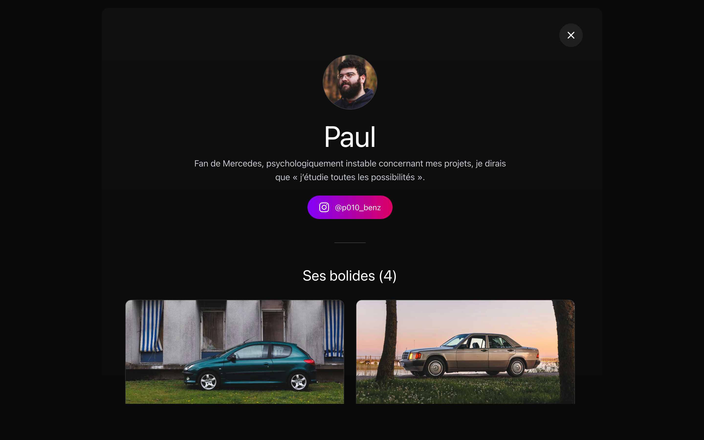

# La Forêt Performance

Site officiel du crew automobile **La Forêt Performance** — un groupe de passionnés de voitures basé en France.

---

## Aperçu

---

## Le projet

LFP est un site vitrine conçu pour mettre en avant le crew, ses membres et leurs véhicules. L'identité visuelle repose sur un univers sombre, minimaliste et cinématographique, avec des animations pensées pour refléter la passion et l'esthétique automobile.

---

## Fonctionnalités

### Site public

- Hero animé avec effet de typing et parallax au scroll
- Section Crew — présentation des membres avec modal détaillé et lien Instagram
- Section Garage — galerie des voitures en grille éditoriale avec modal plein écran, carrousel photo automatique et fiche technique complète
- Section Sorties — historique et événements à venir du crew
- Navigation croisée entre membre et voiture (clic sur propriétaire ↔ clic sur bolide)

### Panel d'administration

- Authentification sécurisée avec gestion de session
- CRUD complet sur les membres, voitures, événements et utilisateurs
- Système de rôles et permissions granulaires (super_admin, admin, editor, viewer)
- Upload et compression d'images avec drag & drop
- Gestion de l'ordre des photos et mode d'affichage par image (cover / contain)
- Tableau de bord avec statistiques
- Accès mobile restreint aux pages sensibles

---

## Stack technique

| Catégorie        | Technologie             |
| ---------------- | ----------------------- |
| Framework        | Next.js 16 (App Router) |
| Langage          | TypeScript strict       |
| Styling          | Tailwind CSS v4         |
| Animations       | Framer Motion, GSAP     |
| Base de données  | PostgreSQL via Prisma   |
| Authentification | NextAuth v4             |
| Stockage images  | Vercel Blob             |
| Déploiement      | Vercel                  |

---

## Licence

Copyright (c) 2026 Baverdie. All rights reserved.  
Voir le fichier [LICENSE](./LICENSE) pour les conditions d'utilisation.
